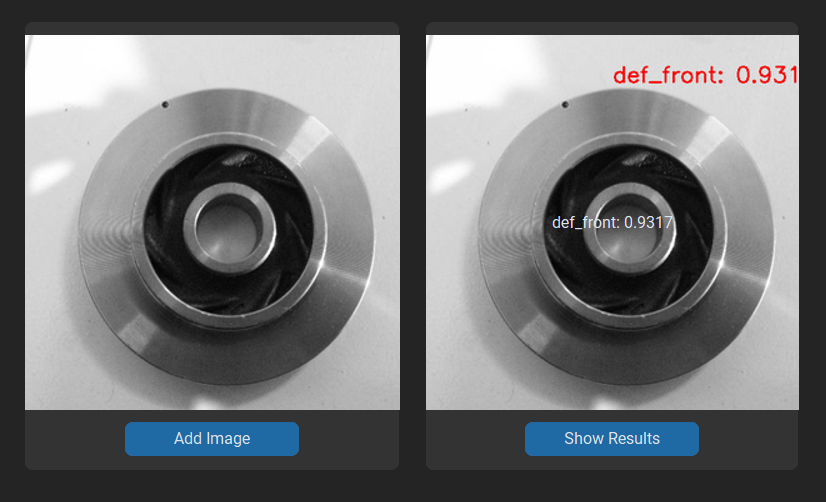
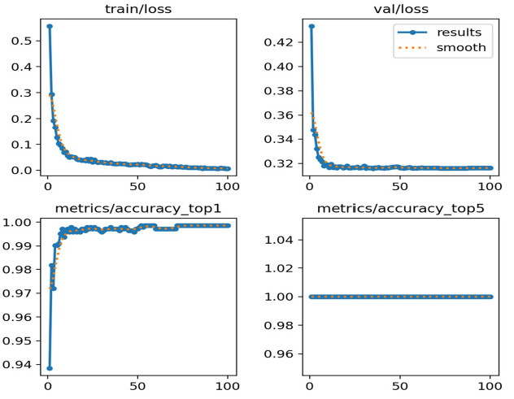
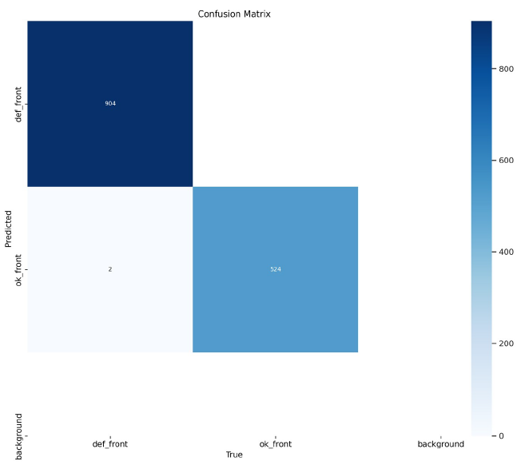

# Casting Product Defect Classification with YOLOv8

A Python application that classifies casting products as defective or non-defective from an image, using a YOLOv8-based classifier trained for robustness against real-world image variation.



## Overview

Manual visual inspection of cast metal parts is slow and inconsistent. This project automates that inspection: a user uploads a photo of a cast part through a desktop app, and the model returns a defective/non-defective verdict with a confidence score — in real time.

A group project for a case study at Deggendorf Institute of Technology, supervised by Prof. Dr. Tim Weber.

## Repository contents

- `image_app_customtkinter.py` — the desktop application (CustomTkinter UI)
- `best.pt` — trained YOLOv8 classification weights
- Project report and presentation slides
- Training code and dataset notes

## How it works

1. **Dataset:** real-life industrial casting product images (defective vs. non-defective), sourced from Kaggle.
2. **Robustness to model drift:** Gaussian noise is deliberately added to training images to simulate real-world variation in image quality and lighting — this is the key design choice of the project, aimed at keeping the model reliable as conditions drift from the training distribution.
3. **Model:** a YOLOv8 classification model (`yolov8m-cls`), fine-tuned via transfer learning on the labeled dataset — trained for 100 epochs, batch size 16, learning rate 0.001, Adam optimizer, image size 512.
4. **Application:** a Python desktop app built with Tkinter/CustomTkinter. The user uploads an image, the trained model classifies it, and the app displays the verdict and confidence score directly in the interface.



## Results

Evaluated with a confusion matrix over precision, recall, and F1-score:

| Model | Precision | Recall | F1 Score | Accuracy |
|---|---|---|---|---|
| **This model (with noise robustness)** | **99.61%** | **100%** | **99.80%** | **99.86%** |
| Without noise robustness | 78.67% | 100% | 88.06% | 90.06% |
| Benchmark: DenseNet (prior published study) | 99.61% | 100% | 99.54% | 99.42% |

Adding Gaussian noise during training was the difference between a fragile model (88% F1) and one that held up under realistic image variation (99.8% F1) — and it edged out a published DenseNet-based approach on the same task.



## Tech stack

Python · YOLOv8 (Ultralytics) · Tkinter / CustomTkinter · OpenCV · Transfer learning

## How to run

```bash
pip install customtkinter ultralytics opencv-python pillow
python image_app_customtkinter.py
```

Make sure the trained model weights (`best.pt`) are in the same folder as the script, or update the path in `show_results()` to point to where your weights are saved. Click **Add Image** to upload a casting photo, then **Show Results** to see the classification and confidence score.

## Limitations

This is a binary classifier (defective / non-defective) over whole images, not a bounding-box detector — it doesn't localize where a defect is within the part. Extending it to true defect localization is a natural next step. Results also reflect the specific casting geometry in the training dataset; generalizing to other part shapes would need additional data.
